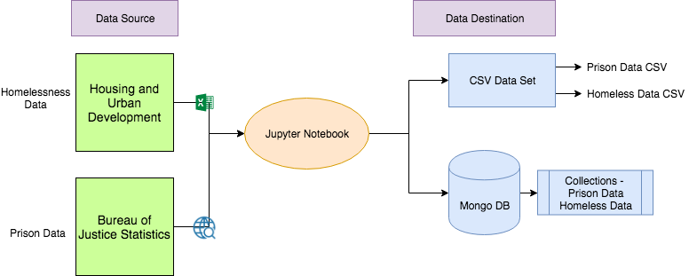
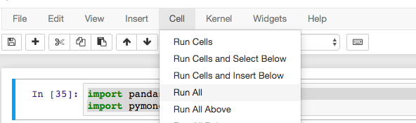

# National-Homelessness-and-Prison-Data
## Ivonne Soto & Pratyush Painuly

## Model: 

**NHPD (National Homelessness and Prison Data)** aims to Extract, Transform and Present data for Homelessness and Prison insights for United States. Our aim is to find detail datasets from various sources and store it in one single repository, which can be further used for analysis and research. We hope to contribute in finding key insights into such an relevant topic and generate discussions based on the data that we have discovered and compiled.

**The key features** of this ETL project are:

-  Explore and transform raw data provided by **Housing and Urban Development(HUD)** for the entire country. Transform the complex data into ready-to-use source. The source file used is HUD Excel metadata(homelessness_data.xlsx).
-  Find a model to identiy key variable for Prison Data. Web Scrapping **Bureau of Justice(BJS)** website to gather the entire data set from 1978-2016 on a national, state level and group the data by proper metrics(Gender, Time period, Jail population). The data scrapped is extensively transformed to make it easy to interpret and analyze.
-  The data sets are loaded and transformed in Jupyter notebook for futher clean up and presentation.
-  Once the data sets are ready to be used and shared to public, the two sets are stored in a local Mongo Database as two separate collections. The data sets are also exported as two separate data dumps. We encourage all researchers/analysts to explore the datasets either by the csv files provided, or from the Mongo DB database that we have created, as per their convenience.

## Using the dataset: 

The datasets can be explored by downloading our jupyter notebook(**BJS_scraping.ipynb**) and running the entire notebook. The notebook will create a local **Mongo Database** with two collections, one for prison data and another for Homeless data. If time is of the essance, or you do not have minimum requirements to run the notebook/mongo db, we encourage the use of the **csv data sets** provided. The csv data files are exactly the same as the documents in the Mongo db collections for the two data sources.

### 1. CSV Data Set
The csv [datasets](https://github.com/ppainuly/National-Homelessness-Data/tree/master/data) can be found in the **data** folder of this repository.   
<pre>
  The folder has the following files - 
  
  <em>homelessness.csv</em> - This file has the entire data from HUD database for United States. 
  
  <em>prison_data.csv</em> - This file has prison data on a National and State level scrapped from BJS website.
</pre> 

### OR

### 2. Jupyter Notebook/Mongo database

#### Requirements - 

1. Python
2. Anaconda Navigator/JupyterNotebook
3. Mongo DB
4. Chromedriver 

You will need the following python dependencies installed on your machine to run the notebook - 

<pre>
import pandas as pd
import pymongo
from splinter import Browser
from bs4 import BeautifulSoup
import requests
from urllib.parse import urlparse
from pprint import pprint
</pre>
To install the dependencies, open terminal(mac) and bash(windows) and run
<pre>
pip install 'module name'
</pre>

For example
**pip install pandas**
to install Pandas and then call the **import pandas as pd** to import pandas

### Run Notebook

On terminal/bash, run Mongo Instange
<pre>
mongod
</pre>

#### Download the notebook BJS_scraping.ipynb. 

Comment out the Mac users part of Chromedriver(and uncomment out the Windows user part) if you are using a windows machine. Else you are good to go.

<pre>
On ln 21:
#Mac Users
executable_path = {'executable_path': '/usr/local/bin/chromedriver'}
browser = Browser('chrome', **executable_path, headless=False)

# Windows Users
# executable_path = {'executable_path': 'chromedriver.exe'}
# browser = Browser('chrome', **executable_path, headless=False)
</pre>

Run all from Cells-->Run All

**Wait 5 mins.** Get some ice-creem or if you are calorie conscious, then get some black coffee and check your social network updates in the meantime. The fun is about to begin. 

Once the notebook is executed, it will create a Mongo DB database with two collections - 

** Database : incarceration**
  ** Collections - **
    ** Prison data : jail_collection**
    ** Homeless Data : prison_data**
    
The following commands show our mongo db set up - 

### Mongo Client
<pre>
conn = "mongodb://localhost:27017"
client = pymongo.MongoClient(conn)
</pre>

### Database
<pre>
db = client.incarceration
</pre>

### Collections
<pre>
db.jail_collection.drop()
db.prison_data
</pre>

### Example Commands to the database

To see the collections in the database - 
<pre>
# Get the collection names in the database
db.collection_names()
</pre>
Output - 
<pre>
['jail_collection', 'prison_data']
</pre>

To get the number of rows in Prison Collection - 
<pre>
# Check collection document count and verify it matches the rows of pd dataframe
db.prison_data.count()
</pre>
Output - 
<pre>
24635
</pre>

Query first row of Prison data - 
<pre>
pprint(list(db.jail_collection.find().limit(1)))
</pre>
Output - 
<pre>
[{'1978': 307276,
  '1979': 314457,
  '1980': 329821,
  '1981': 369930,
  '1982': 413806,
  '1983': 436855,
  '1984': 462002,
  '1985': 502507,
  '1986': 544972,
  '1987': 585084,
  '1988': 627600,
  '1989': 712364,
  '1990': 773919,
  '1991': 825559,
  '1992': 882500,
  '1993': 969301,
  '1994': 1054702,
  '1995': 1125874,
  '1996': 1181919,
  '1997': 1240659,
  '1998': 1307154,
  '1999': 1363686,
  '2000': 1394231,
  '2001': 1404032,
  '2002': 1440144,
  '2003': 1468601,
  '2004': 1497100,
  '2005': 1525910,
  '2006': 1568674,
  '2007': 1596835,
  '2008': 1608282,
  '2009': 1615487,
  '2010': 1613803,
  '2011': 1598968,
  '2012': 1570397,
  '2013': 1576950,
  '2014': 1562319,
  '2015': 1526603,
  '2016': 1505397,
  'State': 'National Statistics',
  'Total/Sex': 'Total',
  '_id': ObjectId('5d74b430c45e7944d4dc2f7a')}]
</pre>

### Explanation of the data - 
The query generates a list of dictionary, with one document in this case. The data set gives prison population count on a National Level, from years 1978-2016. The number corresponding to the key value year is the count for that year. The **State** variable tells us what this variable is pointing to. 
To get the data for a specific state, for example texas, we need to run the query where 'State' = 'Alabama'

<pre>
list(db.jail_collection.find({'State' : 'Alabama'})
</pre>

The query will return prison statistics for all years, for Alabama, for three metrics, Total count, Male count and Female count in a list, containing three dictionaries for each metric.

<pre>
[{'1978': 5625,
  '1979': 5464,
  '1980': 6543,
  '1981': 7657,
  '1982': 9233,
  '1983': 9856,
  '1984': 10482,
  '1985': 11015,
  '1986': 11710,
  '1987': 12827,
  '1988': 12610,
  '1989': 13907,
  '1990': 15665,
  '1991': 16760,
  '1992': 17453,
  '1993': 18624,
  '1994': 19573,
  '1995': 20718,
  '1996': 21760,
  '1997': 22290,
  '1998': 22676,
  '1999': 24658,
  '2000': 26406,
  '2001': 26741,
  '2002': 27947,
  '2003': 27913,
  '2004': 25887,
  '2005': 27888,
  '2006': 28241,
  '2007': 29412,
  '2008': 30508,
  '2009': 31874,
  '2010': 31764,
  '2011': 32270,
  '2012': 32431,
  '2013': 32381,
  '2014': 31771,
  '2015': 30810,
  '2016': 28883,
  'State': 'Alabama',
  'Total/Sex': 'Total',
  '_id': ObjectId('5d74b430c45e7944d4dc2f83')},
 {'1978': 5368,
  '1979': 5221,
  '1980': 6278,
  '1981': 7339,
  '1982': 8757,
  '1983': 9375,
  '1984': 9961,
  '1985': 10453,
  '1986': 11094,
  '1987': 12095,
  '1988': 11858,
  '1989': 13062,
  '1990': 14710,
  '1991': 15705,
  '1992': 16352,
  '1993': 17493,
  '1994': 18359,
  '1995': 19423,
  '1996': 20403,
  '1997': 20930,
  '1998': 21215,
  '1999': 22990,
  '2000': 24580,
  '2001': 24958,
  '2002': 26250,
  '2003': 25910,
  '2004': 24139,
  '2005': 25923,
  '2006': 26191,
  '2007': 27254,
  '2008': 28277,
  '2009': 29419,
  '2010': 29261,
  '2011': 29696,
  '2012': 29782,
  '2013': 29660,
  '2014': 29182,
  '2015': 28220,
  '2016': 26506,
  'State': 'Alabama',
  'Total/Sex': 'Male',
  '_id': ObjectId('5d74b430c45e7944d4dc2f84')},
 {'1978': 257,
  '1979': 243,
  '1980': 265,
  '1981': 318,
  '1982': 476,
  '1983': 481,
  '1984': 521,
  '1985': 562,
  '1986': 616,
  '1987': 732,
  '1988': 752,
  '1989': 845,
  '1990': 955,
  '1991': 1055,
  '1992': 1101,
  '1993': 1131,
  '1994': 1214,
  '1995': 1295,
  '1996': 1357,
  '1997': 1360,
  '1998': 1461,
  '1999': 1668,
  '2000': 1826,
  '2001': 1783,
  '2002': 1697,
  '2003': 2003,
  '2004': 1748,
  '2005': 1965,
  '2006': 2050,
  '2007': 2158,
  '2008': 2231,
  '2009': 2455,
  '2010': 2503,
  '2011': 2574,
  '2012': 2649,
  '2013': 2721,
  '2014': 2589,
  '2015': 2590,
  '2016': 2377,
  'State': 'Alabama',
  'Total/Sex': 'Female',
  '_id': ObjectId('5d74b430c45e7944d4dc2f85')}]
  </pre>
  
  ## Homeless data example
  
  Query to find a certain homeless shelter by row ID
  
  <pre>
inventory = list(db.collection.find({'Row #': 336611}))
print(inventory)
 </pre>
 
 Output - 
 
 <pre>
 [{'_id': ObjectId('5d747ebdc945687db783b7d8'), 'Row #': 336611, 'CocState': 'AR', 'CoC': ' Boone, Baxter, Marion, Newton Counties CoC', 'Coc\\ID': 1493, 'HudNum': 'AR-512', 'Status': 'Submitted', 'year': 2018, 'Organization ID': 12792, 'Organization Name': 'Sanctuary Inc.', 'Project ID': 28012, 'Project Name': 'Domestic Violence Shelter', 'Project Type': 'ES', 'Bed Type': 'F', 'Geo Code': 59009, 'Inventory Type': 'C', 'beginsOperationsWithinYear': nan, 'Target Population A': 'SFHC', 'Target Population B': 'DV', 'Victim Service Provider': 1, 'address1': nan, 'address2': nan, 'city': nan, 'state': nan, 'zip': nan, 'Beds HH w/ Children': 16.0, 'Units HH w/ Children': 5.0, 'HMIS Beds HH w/ Children': nan, 'Veteran Beds HH w/ Children': 0.0, 'Youth Beds HH w/ Children': 0.0, 'CH Beds HH w/ Children': nan, 'Beds HH w/o Children': 0.0, 'HMIS Beds HH w/o Children': nan, 'Veteran Beds HH w/o Children': 0.0, 'Youth Beds HH w/o Children': 0.0, 'CH Beds HH w/o Children': nan, 'Beds HH w/ only Children': 0.0, 'HMIS Beds HH w/ only Children': nan, 'CH Beds HH w only Children': nan, 'Year-Round Beds': 16, 'DV Beds': 16.0, 'Total Seasonal Beds': 0.0, 'Seasonal Beds Available in HMIS': 0.0, 'Availability Start Date': None, 'Availability End Date': None, 'O/V Beds': 0.0, 'HMIS O/V Beds': 0.0, 'PIT Count': 5.0, 'Total Beds': 16, 'Updated On': datetime.datetime(2018, 4, 16, 10, 38, 49), 'questionUsesDescriptorElements': 0, 'questionDesiresToUseDescriptorElements': 0.0, 'notes': nan}]
 </pre>
 
 ### Source - 
 Bureau of Justice - https://www.bjs.gov/index.cfm?ty=nps
 Housing and Urban Development - https://www.hudexchange.info/resource/3031/pit-and-hic-data-since-2007/
